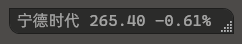
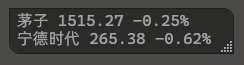
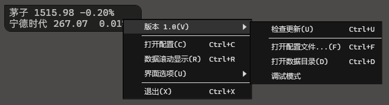
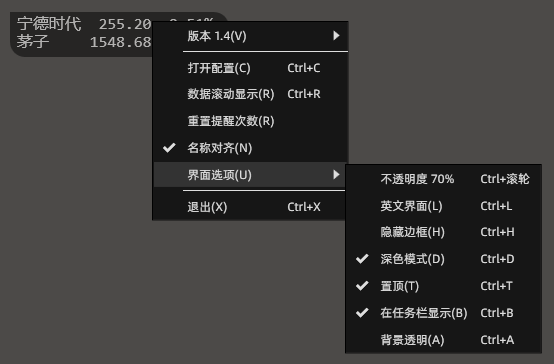
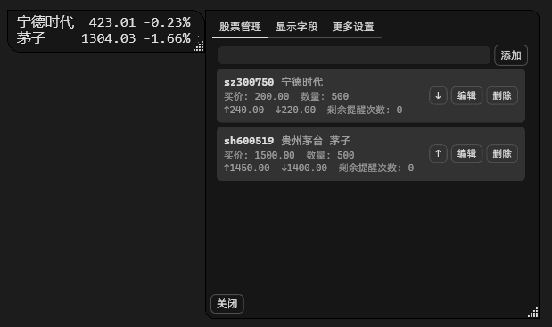
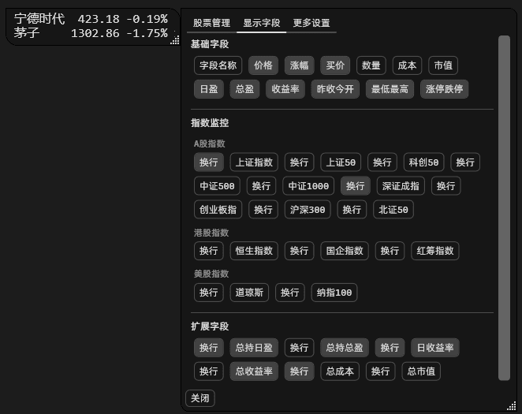
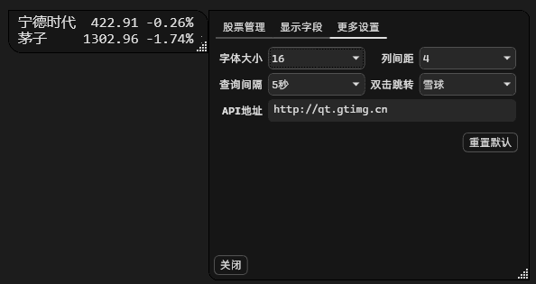
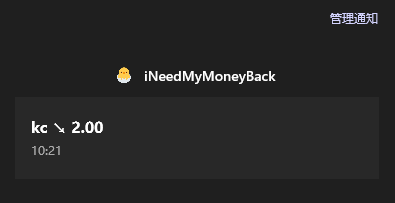
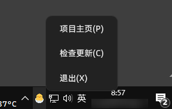
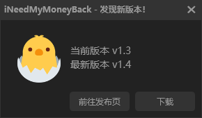

<div align="center">


<h1>iNeedMyMoneyBack</h1>

[](https://github.com/pdone/iNeedMyMoneyBack/releases/latest)
[](https://github.com/pdone/iNeedMyMoneyBack/releases)
[](https://github.com/pdone/iNeedMyMoneyBack/stargazers)
[](https://github.com/pdone/iNeedMyMoneyBack/issues)

一个监控股票的工具

</div>

## 使用说明

### 主界面





- 勾选 `数据滚动显示` 时，始终只显示一条数据，按配置列表滚动显示。
- 未勾选 `数据滚动显示` 时，将显示所有配置中的数据，采用Grid表格布局，支持列对齐显示。
- 界面右下角处，可以拖动来改变大小。
- 双击数据行，可跳转到当前股票的详情页（支持配置跳转到雪球或同花顺）。
- 支持显示表头行，可在配置中选中 `字段名称` 以启用 `表头` 字段。
- 扩展字段（指数监控等）独立显示在主表格下方。

> [!tip]
> 本文档中的图片可能更新不及时，与最新版本界面不一致，请以最新版为准

### 右键菜单




- 菜单项中显示的快捷键都是程序快捷键，仅焦点在本程序界面时有效。
- **程序内置了一个全局快捷键 `Ctrl + ~` ，用于显示或隐藏主界面。**

### 添加和删除



- 打开配置，在 `股票管理` 标签页中输入股票代码，点击 `添加` 按钮或按回车键即可添加监控股票。
- 代码前需要 `sh`、`sz`、`bj`、`us`、`hk` 等前缀，分别代表上海、深圳、北京、美股、港股。
- 支持的交易所：上海（sh）、深圳（sz）、北京（bj）、美股（us）、港股（hk）。
- ⚠️ 美股和港股需要先在 `更多设置` 中启用对应市场，否则无法添加相关股票。
- 点击股票卡片上的 `删除` 按钮，确认后可删除监控股票。
- 双击股票卡片或点击 `编辑` 按钮，可修改别名、买入价、数量、提醒价格等信息。
- 使用 `↑` 和 `↓` 按钮可调整股票在列表中的显示顺序。
- 设置 `别名` 后，主界面就不再显示 `名称`，而是显示 `别名`。
- 买价为单股价格，数量为股数（不是手数）。
- 添加股票时会自动验证代码有效性，无效代码会提示错误。

### 显示字段控制



- 配置界面分为三个Tab标签页：`股票管理`、`显示字段` 和 `更多设置`。
- 在 `显示字段` 标签页中，可控制基础字段、指数监控、扩展字段的显示。
- 单击后按钮背景变为浅色，即为启用。
- 指数监控按市场分组显示：A股指数、港股指数、美股指数。
- 程序内置了多个指数，包括：上证指数、深证成指、创业板指、沪深300、北证50、上证50、中证500、中证1000、科创50、恒生指数、国企指数、红筹指数、道琼斯、纳斯达克100。
- 这些指数不允许添加监控，只能在配置界面启用显示。
- 港股和美股指数需要先在 `更多设置` 中启用对应市场才会显示。

### 更多设置



- `字体大小`：可调整主界面字体大小，支持 12/14/16/18/20/24。
- `查询间隔`：可调整数据刷新间隔，支持 2/5/10/30/60/300/600/1800 秒。
- `列间距`：可调整表格列间距，支持 2/4/6/8/10/12/16。
- `API地址`：可自定义数据接口地址，支持验证功能。
- `双击跳转`：可配置双击股票行时跳转到雪球或同花顺。
- `排序字段`：可设置股票列表的排序依据，支持：默认/涨跌幅/买价/总成本/总市值/日盈/总盈/收益率。
- `排序方式`：可设置排序方向，支持：降序/升序。
- `启用美股`：启用后可添加美股股票（如 usAAPL）并显示美股指数。⚠️ 由于接口限制，美股数据存在延迟，不具备实时参考意义。
- `启用港股`：启用后可添加港股股票（如 hk00700）并显示港股指数。⚠️ 由于接口限制，港股数据存在延迟，不具备实时参考意义。

### 高于或低于指定价格时发送系统通知

需要在配置页面配置高于或低于的目标价格，默认只提醒一次，不建议手动修改剩余次数，建议使用右键菜单中的 `重置提醒次数`，会将所有股票的剩余提醒次数都改为1。



### 托盘图标和菜单



### 检查更新



- 前往发布页按钮，点击后跳转到最新版Github Release发布页面。
- 下载按钮，点击后跳转到Github Latest版本原始下载链接。

> [!note]
> 检查更新功能是我另一个开源项目 [Pdone.Updater](https://github.com/pdone/Pdone.Updater/)，一个专为Github开源项目设计的更新器，可以前往项目主页查看和使用，非C#项目也可以轻松集成使用。

## 下载

### GitHub Release

https://github.com/pdone/iNeedMyMoneyBack/releases/latest/download/iNeedMyMoneyBack.exe

## 常见问题

### 数据来源

https://qt.gtimg.cn/

### 数据对齐显示

2.0版本采用Grid表格布局，数据自动按列对齐显示，无需手动配置对齐方式。

主界面支持显示表头行，可在配置中启用 `表头` 字段，显示各列的名称。

表格中的数值列（如价格、涨跌幅、盈亏等）自动右对齐，名称列左对齐，特殊字段（如昨收今开、最低最高等）居中对齐。

列间距可在配置界面的 `更多设置` 中调整，支持 2/4/8/10/12/16。

推荐安装 [fonts](/fonts/) 中的字体，以实现更好的显示效果。可以在配置文件中修改对应模块的字体，也可在 `更多设置` 中调整主界面字体大小。

```
{
  ...
  "FontFamilyMain": "Courier New,Consolas,Microsoft Yahei UI,Arial",// 主页面
  "FontFamilyConfig": "阿里巴巴普惠体 3.0,Microsoft YaHei UI,Arial",// 配置页面
  "FontFamilyMenu": "阿里巴巴普惠体 3.0,Microsoft YaHei UI,Arial",// 右键菜单页面
  ...
}
```

> [!note]
> 程序日志和配置文件目录
> ```
> %AppData%/iNeedMyMoneyBack
> ```

### 问题反馈

提交 Issue 即可。

### 投资建议

根据程序名称不难发现，作者无法提供任何有用的投资建议。

如果你有专业的金融知识，但缺少编程知识，可以考虑联系合作。

### 贡献代码

该项目使用 C# 开发，极其容易上手，欢迎有能力的朋友一起为开源社区做贡献。

## 赞助

如果您觉得这个项目对您有帮助，欢迎请作者喝杯咖啡。☕

<details>
<summary>展开</summary>


</details>

## 更新日志

[](/Update.md)
