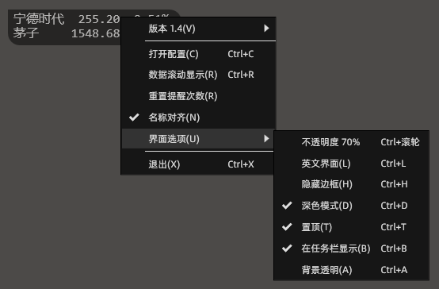
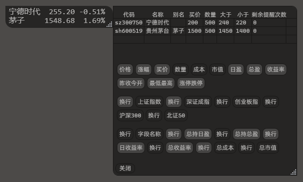

<div align="center">


<h1>iNeedMyMoneyBack</h1>

[](https://github.com/pdone/iNeedMyMoneyBack/releases/latest)
[](https://github.com/pdone/iNeedMyMoneyBack/releases)
[](https://github.com/pdone/iNeedMyMoneyBack/stargazers)
[](https://github.com/pdone/iNeedMyMoneyBack/issues)

</div>

## 简介

一个监控股票的工具。

## 使用说明

### 主界面


- 勾选 `数据滚动显示` 时，始终只显示一条数据，按配置列表滚动显示。
- 未勾选 `数据滚动显示` 时，将显示所有配置中的数据。
- 界面右下角处，可以拖动来改变大小。
- ~~建议安装 fonts 文件夹中的两个字体，以达到最佳显示效果。~~
- 双击数据行，可跳转到当前股票的详情页。

### 右键菜单




- 菜单项中显示的快捷键都是程序快捷键，仅焦点在本程序界面时有效。
- **程序内置了一个全局快捷键 `Ctrl + ~` ，用于显示或隐藏主界面。**

### 添加和删除


- 打开配置，在 `代码` 列双击空白单元格，输入股票代码后按回车键保存修改，即可添加要监控的股票。
- 代码前需要 `sh`、`sz`、`bj` 等前缀，分别代表上海、深圳、北京。
- 将 `代码` 删除，按回车键，可以删除监控股票。
- 设置 `别名` 后，主界面就不再显示 `名称`，而是显示 `别名`。
- 买价为单股价格，数量为股数（不是手数）。

### 显示字段控制




- 单击后按钮背景变为浅色，即为启用。
- 程序内置了一些指数，这些指数不允许添加监控。

### 高于或低于指定价格时发送系统通知

需要在配置页面配置高于或低于的目标价格，默认只提醒一次，不建议手动修改剩余次数，建议使用右键菜单中的 `重置提醒次数`，会将所有股票的剩余提醒次数都改为1。


## 下载

### GitHub Release

https://github.com/pdone/iNeedMyMoneyBack/releases/latest/download/iNeedMyMoneyBack.exe

## 常见问题

### 数据来源

https://qt.gtimg.cn/

### 数据对齐显示

股票名称（别名）需要勾选 `名称对齐`，其他列自动根据实时数据长度动态对齐。

由于 [fonts](/fonts/) 中的两个字体都不支持显示全角空格，故修改默认字体为 `Courier New` 以支持中英文字符混合对齐。

你也可以在配置文件中修改对应模块的字体，自行测试对齐效果。

```
  "FontFamilyMain": "Courier New,Consolas,Microsoft Yahei UI,Arial",// 主页面
  "FontFamilyConfig": "阿里巴巴普惠体 3.0,Microsoft YaHei UI,Arial",// 配置页面
  "FontFamilyMenu": "阿里巴巴普惠体 3.0,Microsoft YaHei UI,Arial",// 右键菜单页面
```

> [!tip]
> 配置文件路径 `%AppData%\iNeedMyMoneyBack\config.json`

<details>
<summary>已过时</summary>

~~安装 [fonts](/fonts/) 文件夹中的**等宽字体**，并且**设置别名**，确保**别名长度一致**，可以让数据对齐显示。~~

> ~~也可以到字体官方网站下载 [阿里巴巴普惠体](https://www.alibabafonts.com/#/font)、[Cascadia Code](https://github.com/microsoft/cascadia-code)~~

~~股票名称（别名）不会动态对齐，其他列根据实时数据长度动态对齐。~~

</details>

### 程序日志和配置文件路径

`%AppData%/iNeedMyMoneyBack`

### 问题反馈

提交 Issue 即可。

### 投资建议

根据程序名称不难发现，作者无法提供任何有用的投资建议。

如果你有专业的金融知识，但缺少编程知识，可以考虑联系合作。

### 贡献代码

该项目使用 C# 开发，极其容易上手，欢迎有能力的朋友一起为开源社区做贡献。

## 赞助

如果您觉得这个项目对您有帮助，欢迎请作者喝杯咖啡。☕

<details>
<summary>展开</summary>


</details>

## 更新日志

[](/Update.md)
