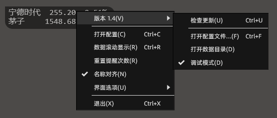
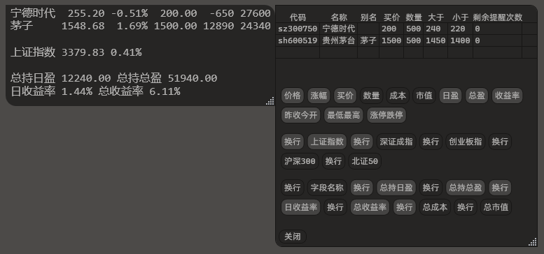

<h1>iNeedMyMoneyBack</h1>

### 主界面

- 勾选 `数据滚动显示` 时，始终只显示一条数据，按配置列表滚动显示。
- 未勾选 `数据滚动显示` 时，将显示所有配置中的数据。
- 界面右下角处，可以拖动来改变大小。

### 菜单

- 菜单项中显示的快捷键都是程序快捷键，仅焦点在本程序界面时有效。
- 程序内置了一个全局快捷键 `Ctrl + ~` ，用于显示或隐藏主界面。

### 添加和删除

- 打开配置，在 `代码` 列双击空白单元格，输入股票代码后按回车键保存修改，即可添加要监控的股票。
- 代码前需要 `sh`、`sz`、`bj` 等前缀，分别代表上海、深圳、北京。
- 将 `代码` 删除，按回车键，可以删除监控股票。
- 设置 `别名` 后，主界面就不再显示 `名称`，而是显示 `别名`。
- 买价为单股价格，数量为股数（不是手数）。

### 显示字段控制

- 单击后按钮背景变为浅色，即为启用。
- 程序内置了一些指数，这些指数不允许添加监控。
